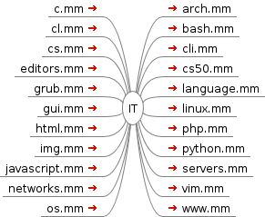

<!--
File          : README.md

Created       : Mon 02 Nov 2015 02:11:18
Last Modified : Mon 02 Nov 2015 02:15:37
Maintainer    : sharlatan
-->

# IT-mm
_FreeMind ready maps_

__27428   ../IT-mm/__

This repository contains mind maps (mm) of my IT-CS (Information Technology -  
Computer Science) self education. It could be helpfully for beginners  
to start exploring the world of IT.  

I am concentrated on _"GNU/Linux side"_ of IT world, and the most comprehensive  
mm is operating system's (os.mm). It includes hierarchy mm of os history and
GNU/Linux  distribution derivatives. 

Every mm includes credits, links and references.

## How to start ##
To obtain IT-mm you have to download and unpack them, easy isn't it :)?

#### Using Git ####
This command downloads the whole project in your __$: pwd__ under the name "IT-mm".

    $: git clone https://github.com/Hellseher/IT-mm  

#### Using browser ####
Click __Download ZIP__ on right hand side of the screen.

## Software ##
For the best compatibility install or compile FreeMind of version 1.0.1 of or  
higher.  If for some reason you can't find appropriate version for your machine  
in projects branch, try to compile it from scratch.  

[FreeMind](http://freemind.sourceforge.net/wiki/index.php/Main_Page)
