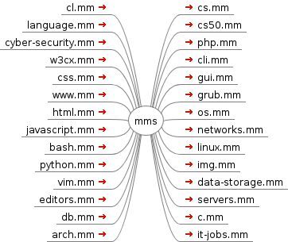

<!--
File          : README_ru.md

Created       : Mon 02 Nov 2015 02:12:47
Last Modified : Sun Mar 20 2016 23:02:01 sharlatan
Maintainer    : sharlatan
-->

# IT-mm
_Собранные карты для FreeMind_

__27428   ../IT-mm/__

Этот репозиторий содержит "карты разума" (mind maps - mm)  
Информационных технологий и компьютерных наук. 
Могут быть полезны для самообразоания.

Я соредоточился на сфере свободного ПО _"GNU/Linux"_ и самая подробная mm это  
карта os.mm (operating systems). Она включает в себя исторюи, в иирархическом  
порядке, развития опереционных систем и подробное описание дистрибутивов GNU/Linux.

В каждой карте указаны множество ссылок на источники.
Все карты на Английском языке.

## Как начать ##
Что бы получить карты вы должны скачать и распоковать их, просто не так ли :)?

#### Используя Git ####
Следующая команда скачает весь проект в __$: pwd__ (текущую папку/каталог) как
"IT-mm".

    $: git clone https://github.com/Hellseher/IT-mm

#### Используя браузер ####
Нажмите __Download ZIP__  в правой части экрана.

## Софт ##
Для наилучшей совместимости установите или скопилируйте FreeMind версии не ниже
1.0.1. Если не нашлось подходящей версии на сайте проекта соберите FreeMind
сами.

[FreeMind](http://freemind.sourceforge.net/wiki/index.php/Main_Page)
